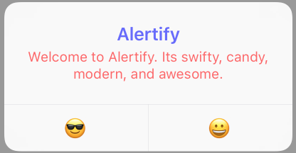

# Alertify


[](http://cocoapods.org/pods/Alertify)
[](http://cocoapods.org/pods/Alertify)
[](http://cocoapods.org/pods/Alertify)

## Feature
- Method chain.
- Can add multiple actions at once.
- UITextField support.
- Image support
- iPad support(Action Sheet, popover).
- Can change title/message/button text/ background color **without** using private APIs.
- Can change title/message's alignment **without** using private APIs.

## Requirements
- iOS 10.0+
- Xcode 8.1+
- Swift 3.0+

## Installation

Alertify is available through [CocoaPods](http://cocoapods.org). To install
it, simply add the following line to your Podfile:

```ruby
pod 'Alertify'
```


```swift
        Alertify.actionSheet(message: nil, anchorView: sender)
                .action(.default("Hello"), image: #imageLiteral(resourceName: "chat"))
                .action(.default("Info"), image: #imageLiteral(resourceName: "info"))
                .action(.cancel("None"))
                .finally { action, index in
                      if action.style == .cancel {
                         return
                       }
                    }
                  .show(on: self)
```

## Author

karthikAdaptavant, karthik.samy@a-cti.com

## License

Alertify is available under the MIT license. See the LICENSE file for more info.
